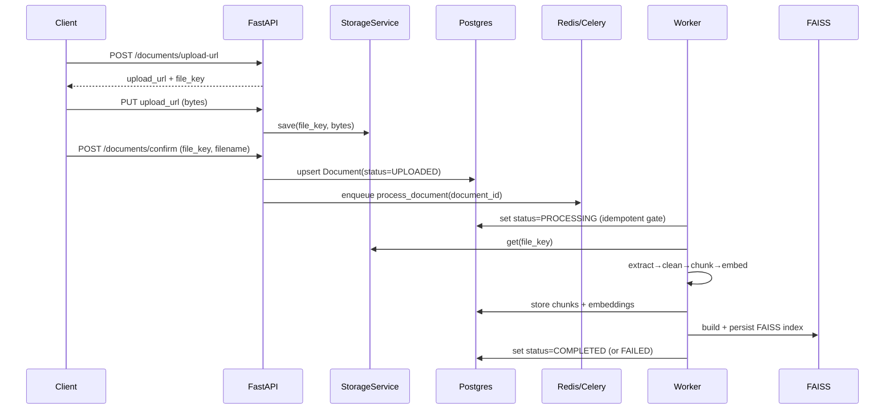
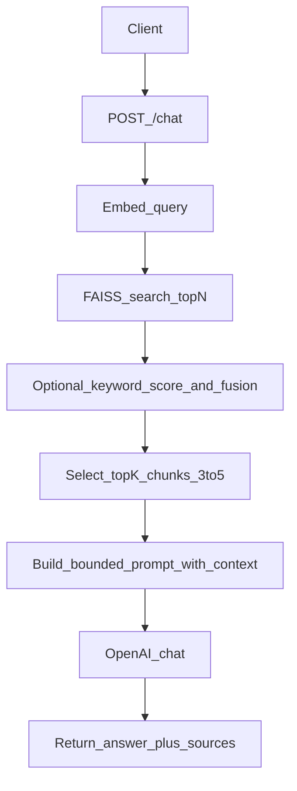

# DocuMind

Production-oriented backend for **RAG-based document ingestion + grounded conversational AI**, built with **clean architecture**, **async processing**, and a **local dev workflow that simulates production S3-style uploads**.

## What is this project?
`DocuMind` is a backend service that lets clients upload documents into a knowledge base, processes them asynchronously into a searchable vector index, and exposes a chat API that answers questions **only using retrieved document context** (grounded RAG).

## Tech stack
- **Python 3.11+** + **Poetry**: packaging and dependency management
- **FastAPI**: HTTP API layer
- **PostgreSQL**: metadata + chunks (+ embeddings for V1 debuggability)
- **Redis**: Celery broker/backend \(and later optional caching/locks\)
- **Celery**: background processing workers
- **FAISS**: local vector store (V1: per-document index on disk)
- **OpenAI**: embeddings + chat via service abstractions

## High-level system design

### Components
- **FastAPI**: HTTP API, request validation, dependency injection.
- **PostgreSQL**: source of truth for documents + chunks + embeddings metadata.
- **Redis**: Celery broker; optional embedding cache; distributed locks for idempotency.
- **Celery workers**: async pipeline execution with retries.
- **FAISS**: vector index (V1: per-document index on disk).
- **OpenAI providers**: embeddings + chat via small abstraction layer (so we can swap later).

### Document upload & processing flow


### Chat (grounded RAG) flow


Grounding policy: the system prompt will instruct the model to **only** use retrieved context and to say it **doesn’t know** if the context is insufficient.

## Running locally

### Prereqs
- Python \(>=3.11,<3.15\)
- Poetry
- Docker Desktop \(for Postgres + Redis\)

### Install

```bash
poetry install
```

### Start infrastructure (Postgres + Redis)

```bash
docker compose up -d
```

### Run migrations

```bash
poetry run alembic upgrade head
```

### Run API

```bash
poetry run uvicorn app.main:app --reload
```

### Health check

```bash
curl -sSf http://127.0.0.1:8000/healthz
```

### Upload (local S3-like flow)
1. `POST /documents/upload-url` to get `upload_url` + `file_key`
2. `PUT upload_url` with raw bytes
3. `POST /documents/confirm` with `file_key` + `filename`
4. `GET /documents/{id}/status`

## Repo guide
See `docs/REPO_GUIDE.md` for a walkthrough of the codebase and short explanations of the main building blocks (Celery, Alembic, FAISS, etc.).
